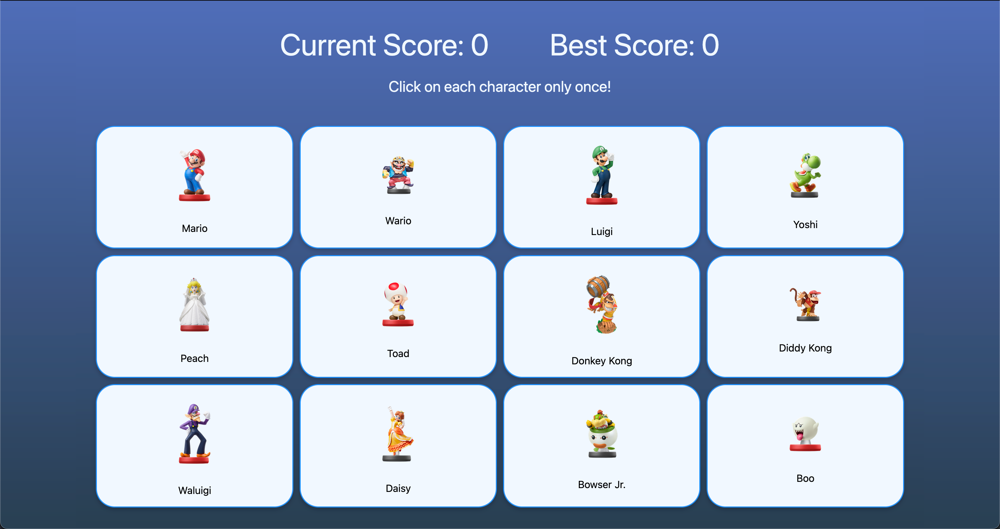

# Mario Memory Card Game

[](https://memory-card-game-83x.pages.dev/)

## About this app

This app is a straightforward project for practicing React and experiment with the useEffect hook to fetch from an external API.

## Demo

You can view a live demo of the app [here.](https://memory-card-game-83x.pages.dev/)

## Features

- **Play game**: Player can select each card only once.
- **Keep score**: The current score and the best score will update in real time.

## Technologies Used

- React
- CSS
- Cloufare (to deploy the app)

## How to Use

- Clone or download the repository to your local machine.
- Have node installed on your machine.
- Run ```npm install```
- Run ```npm run dev```
- Open ```http://localhost:5173/``` in your browser.
